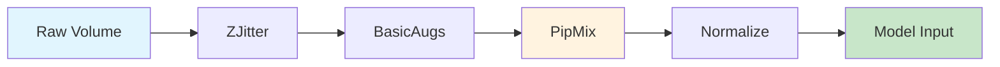

# Augmentation Pipeline

This document describes the data augmentation strategy for 3D volumetric surface detection.

## Pipeline Overview

The augmentation pipeline follows a specific order optimized for 3D medical/CT-like data:



## Pipeline Steps

### Step 1: Volume Selection with Z-Jitter

**Purpose:** Adds depth-axis variation to make the model robust to slight misalignments in Z-slices.

```
┌─────────────────────────────────────────┐
│  Original Volume (D, H, W)              │
│  ████████████████████████████████████   │
│  ████████████████████████████████████   │
│  ████████████████████████████████████   │
└─────────────────────────────────────────┘
                     │
                     ▼ Random shift ±N slices
┌─────────────────────────────────────────┐
│  Shifted Volume                         │
│  ░░░░████████████████████████████████   │
│  ░░░░████████████████████████████████   │
│  ░░░░████████████████████████████████   │
└─────────────────────────────────────────┘
       ↑
       Zero-padded region
```

- **Parameter:** `jitter_range` (default: 5 slices)
- **Applied to:** Both image and label
- **Wrapped edges:** Zero-padded (image=0, label=unlabeled)

---

### Step 2: Basic Augmentations

**Purpose:** Standard geometric transformations for spatial invariance.

| Transform | Axis | Probability | Description |
|-----------|------|-------------|-------------|
| HorizontalFlip | X (Width) | 0.5 | Left-right flip |
| VerticalFlip | Y (Height) | 0.5 | Top-bottom flip |
| RandomRotate90 | H-W plane | 0.5 | 90°, 180°, or 270° rotation |

```
Original          HFlip            VFlip           Rot90
┌───────┐        ┌───────┐        ┌───────┐       ┌───────┐
│ A   B │        │ B   A │        │ C   D │       │ C   A │
│       │   →    │       │   OR   │       │  OR   │       │
│ C   D │        │ D   C │        │ A   B │       │ D   B │
└───────┘        └───────┘        └───────┘       └───────┘
```

---

### Step 3: PipMix (Batch-Level)

**Purpose:** Mix two volumes using CutMix-style approach for 3D data. Improves generalization and regularization.

```
Volume A                      Volume B
┌─────────────────┐          ┌─────────────────┐
│ ░░░░░░░░░░░░░░░ │          │ █████████████████│
│ ░░░░░░░░░░░░░░░ │    +     │ █████████████████│
│ ░░░░░░░░░░░░░░░ │          │ █████████████████│
└─────────────────┘          └─────────────────┘
         │                            │
         └──────────┬─────────────────┘
                    ▼
            Mixed Volume (λ = 0.7)
         ┌─────────────────┐
         │ ░░░░░░░░░░░░░░░ │
         │ ░░░██████░░░░░░ │  ← Cut region from B
         │ ░░░██████░░░░░░ │
         └─────────────────┘
```

- **Parameter:** `alpha` for Beta distribution (default: 1.0)
- **Returns:** Mixed image, mixed label, λ value
- **Note:** Applied at batch-level in training loop

---

### Step 4: Normalize

**Purpose:** Standardize input values for stable training.

```
Formula: x_norm = (x - mean) / std
```

- **Stats source:** `dataset/stats/mean_std.npy`
- **Fallback:** mean=127.5, std=127.5 (for uint8 data)
- **Applied to:** Image only (labels unchanged)

---

## Train vs Validation Pipeline

| Step | Training | Validation |
|------|----------|------------|
| 1. ZJitter | ✅ | ❌ |
| 2. BasicAugs | ✅ | ❌ |
| 3. PipMix | ✅ (batch-level) | ❌ |
| 4. Normalize | ✅ | ✅ |

```python
# Usage
from src.data.transforms import get_train_transforms, get_val_transforms, get_pipmix

train_transform = get_train_transforms(stats_path='dataset/stats/mean_std.npy')
val_transform = get_val_transforms(stats_path='dataset/stats/mean_std.npy')
pipmix = get_pipmix()  # Use in training loop
```

---

## Complete Training Loop Integration

```python
# In training loop:
for batch in dataloader:
    # 1. Get pairs of samples
    img1, lbl1 = batch['image'][::2], batch['label'][::2]
    img2, lbl2 = batch['image'][1::2], batch['label'][1::2]
    
    # 2. Apply PipMix (optional, based on probability)
    mixed_img, mixed_lbl, lam = pipmix(img1, lbl1, img2, lbl2)
    
    # 3. Forward pass
    output = model(mixed_img)
    
    # 4. Calculate loss (consider λ for mixed labels)
    loss = criterion(output, mixed_lbl)
```

---

## Files

| File | Description |
|------|-------------|
| `src/data/transforms.py` | All transform classes |
| `scripts/compute_mean_std.py` | Script to compute dataset statistics |
| `dataset/stats/mean_std.npy` | Precomputed mean and std |
| `notebook/03_augmentation_visualization.ipynb` | Interactive visualization |
